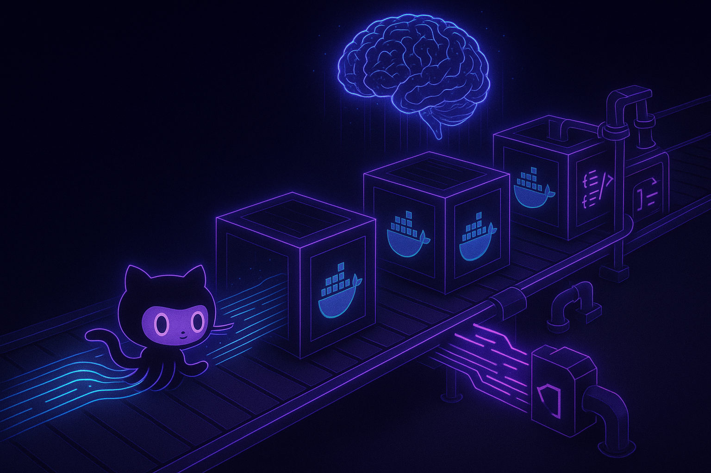

# Claude GitHub Webhook

[](https://discord.com/widget?id=1377708770209304676&theme=dark)
[](https://github.com/claude-did-this/claude-hub/actions/workflows/main.yml)
[](https://github.com/claude-did-this/claude-hub/actions/workflows/security.yml)
[](test/README.md)
[](https://codecov.io/gh/claude-did-this/claude-hub)
[](https://github.com/claude-did-this/claude-hub/releases)
[](https://hub.docker.com/r/intelligenceassist/claude-hub)
[](package.json)
[](https://github.com/hesreallyhim/awesome-claude-code)
[](LICENSE)

🚀 **[Quick Start Guide](./QUICKSTART.md)** | 💬 **[Discord](https://discord.com/widget?id=1377708770209304676&theme=dark)** | 📚 **[Documentation](https://claude-did-this.com/claude-hub/overview)** | 📖 **[Complete Setup](./docs/complete-workflow.md)** | 🔐 **[Authentication](./docs/claude-authentication-guide.md)**



Deploy Claude Code as a fully autonomous GitHub bot. Create your own bot account, mention it in any issue or PR, and watch AI-powered development happen end-to-end. Claude can implement complete features, review code, merge PRs, wait for CI builds, and run for hours autonomously until tasks are completed. Production-ready microservice with container isolation, automated workflows, and intelligent project management. 

## What This Does

```bash
# In any GitHub issue or PR (using your configured bot account):
@YourBotName implement user authentication with OAuth
@YourBotName review this PR for security vulnerabilities  
@YourBotName fix the failing CI tests and merge when ready
@YourBotName refactor the database layer for better performance
```

Claude autonomously handles complete development workflows. It analyzes your entire repository, implements features from scratch, conducts thorough code reviews, manages pull requests, monitors CI/CD pipelines, and responds to automated feedback - all without human intervention. No context switching. No manual oversight required. Just seamless autonomous development where you work.

## 🚀 Quick Start

**Follow our [10-minute Quick Start Guide](./QUICKSTART.md)** to get Claude responding to your GitHub issues using Cloudflare Tunnel - no domain or complex setup required!

```bash
# 1. Clone and configure
git clone https://github.com/claude-did-this/claude-hub.git
cd claude-hub
cp .env.quickstart .env
nano .env  # Add your GitHub token and bot details

# 2. Authenticate Claude (uses your Claude.ai Max subscription)
./scripts/setup/setup-claude-interactive.sh

# 3. Start the service
docker compose up -d

# 4. Create a tunnel (see quickstart guide for details)
cloudflared tunnel --url http://localhost:3002
```

That's it! Your bot is ready to use. See the **[complete quickstart guide](./QUICKSTART.md)** for detailed instructions and webhook setup.

## Autonomous Workflow Capabilities

### End-to-End Development 🚀
- **Feature Implementation**: From requirements to fully tested, production-ready code
- **Code Review & Quality**: Comprehensive analysis including security, performance, and best practices
- **PR Lifecycle Management**: Creates branches, commits changes, pushes code, and manages merge process
- **CI/CD Monitoring**: Actively waits for builds, analyzes test results, and fixes failures
- **Automated Code Response**: Responds to automated review comments and adapts based on feedback

### Intelligent Task Management 🧠
- **Multi-hour Operations**: Continues working autonomously until complex tasks are 100% complete
- **Dependency Resolution**: Handles blockers, waits for external processes, and resumes work automatically
- **Context Preservation**: Maintains project state and progress across long-running operations
- **Adaptive Problem Solving**: Iterates on solutions based on test results and code review feedback

## Key Features

### Autonomous Development 🤖
- **Complete Feature Implementation**: Claude codes entire features from requirements to deployment
- **Intelligent PR Management**: Automatically creates, reviews, and merges pull requests
- **CI/CD Integration**: Waits for builds, responds to test failures, and handles automated workflows
- **Long-running Tasks**: Operates autonomously for hours until complex projects are completed
- **Auto-labeling**: New issues automatically tagged by content analysis
- **Context-aware**: Claude understands your entire repository structure and development patterns
- **Stateless execution**: Each request runs in isolated Docker containers

### Performance Architecture ⚡
- Parallel test execution with strategic runner distribution
- Conditional Docker builds (only when code changes)
- Repository caching for sub-second response times
- Advanced build profiling with timing metrics

### Enterprise Security 🔒
- Webhook signature verification (HMAC-SHA256)
- AWS IAM role-based authentication
- Pre-commit credential scanning
- Container isolation with minimal permissions
- Fine-grained GitHub token scoping


## Bot Account Setup

**Current Setup**: You need to create your own GitHub bot account:

1. **Create a dedicated GitHub account** for your bot (e.g., `MyProjectBot`)
2. **Generate a Personal Access Token** from the bot account with repository permissions
3. **Configure the bot username** in your environment variables
4. **Add the bot account** as a collaborator to your repositories

**Future Release**: We plan to release this as a GitHub App that provides a universal bot account, eliminating the need for individual bot setup while maintaining the same functionality for self-hosted instances.

## Production Deployment

### 1. Environment Configuration

```bash
# Core settings  
BOT_USERNAME=YourBotName              # GitHub bot account username (create your own bot account)
GITHUB_WEBHOOK_SECRET=<generated>     # Webhook validation
GITHUB_TOKEN=<fine-grained-pat>       # Repository access (PAT from your bot account)

# Claude Authentication - Choose ONE method:

# Option 1: Setup Container (Personal/Development)
# Use existing Claude Max subscription (5x or 20x plans)
# See docs/setup-container-guide.md for setup

# Option 2: Direct API Key (Production/Team)
ANTHROPIC_API_KEY=sk-ant-your-api-key

# Option 3: AWS Bedrock (Enterprise)
AWS_REGION=us-east-1
ANTHROPIC_MODEL=anthropic.claude-3-sonnet-20240229-v1:0
CLAUDE_CODE_USE_BEDROCK=1

# Security
AUTHORIZED_USERS=user1,user2,user3    # Allowed GitHub usernames
CLAUDE_API_AUTH_REQUIRED=1            # Enable API authentication
```

## Authentication Methods

### Setup Container (Personal/Development)
Use your existing Claude Max subscription for automation instead of pay-per-use API fees:

```bash
# 1. Run interactive authentication setup
./scripts/setup/setup-claude-interactive.sh

# 2. In container: authenticate with your subscription
claude --dangerously-skip-permissions  # Follow authentication flow
exit                                    # Save authentication

# 3. Use captured authentication  
cp -r ${CLAUDE_HUB_DIR:-~/.claude-hub}/* ~/.claude/
```

**Prerequisites**: Claude Max subscription (5x or 20x plans). Claude Pro does not include Claude Code access.  
**Details**: [Setup Container Guide](./docs/setup-container-guide.md)

### Direct API Key (Production/Team)
```bash
ANTHROPIC_API_KEY=sk-ant-your-api-key-here
```

**Best for**: Production environments, team usage, guaranteed stability.  
**Details**: [Authentication Guide](./docs/claude-authentication-guide.md)

### AWS Bedrock (Enterprise)
```bash
AWS_REGION=us-east-1
ANTHROPIC_MODEL=anthropic.claude-3-sonnet-20240229-v1:0
CLAUDE_CODE_USE_BEDROCK=1
```

**Best for**: Enterprise deployments, AWS integration, compliance requirements.  
**Details**: [Authentication Guide](./docs/claude-authentication-guide.md)

### 2. GitHub Webhook Setup

1. Navigate to Repository → Settings → Webhooks
2. Add webhook:
   - **Payload URL**: `https://your-domain.com/api/webhooks/github`
   - **Content type**: `application/json`
   - **Secret**: Your `GITHUB_WEBHOOK_SECRET`
   - **Events**: Select "Send me everything"

### 3. AWS Authentication Options

```bash
# Option 1: IAM Instance Profile (EC2)
# Automatically uses instance metadata

# Option 2: ECS Task Role
# Automatically uses container credentials

# Option 3: AWS Profile
./scripts/aws/setup-aws-profiles.sh

# Option 4: Static Credentials (not recommended)
AWS_ACCESS_KEY_ID=xxx
AWS_SECRET_ACCESS_KEY=xxx
```

## Advanced Usage

### Direct API Access

Create async Claude sessions via the webhook API:

```bash
# Create a new session
curl -X POST http://localhost:3002/api/webhooks/claude \
  -H "Content-Type: application/json" \
  -H "Authorization: Bearer your-webhook-secret" \
  -d '{
    "type": "session.create",
    "session": {
      "type": "implementation",
      "project": {
        "repository": "owner/repo",
        "requirements": "Analyze security vulnerabilities"
      }
    }
  }'

# Check session status
curl -X POST http://localhost:3002/api/webhooks/claude \
  -H "Content-Type: application/json" \
  -H "Authorization: Bearer your-webhook-secret" \
  -d '{
    "type": "session.get",
    "sessionId": "session-id-from-create"
  }'
```

### CLI Tool

```bash
# Basic usage
./cli/claude-webhook myrepo "Review the authentication flow"

# PR review
./cli/claude-webhook owner/repo "Review this PR" -p -b feature-branch

# Specific issue
./cli/claude-webhook myrepo "Fix this bug" -i 42
```

### Container Execution Modes

Different operations use tailored security profiles for autonomous execution:

- **Auto-tagging**: Minimal permissions (Read + GitHub tools only)
- **PR Reviews**: Standard permissions (full tool access with automated merge capabilities)
- **Feature Development**: Full development permissions (code editing, testing, CI monitoring)
- **Long-running Tasks**: Extended container lifetime with checkpoint/resume functionality
- **Custom Commands**: Configurable via `--allowedTools` flag

## Architecture Deep Dive

### Autonomous Request Flow

```
GitHub Event → Webhook Endpoint → Signature Verification
     ↓                                      ↓
Container Spawn ← Command Parser ← Event Processor
     ↓
Claude Analysis → Feature Implementation → Testing & CI
     ↓                     ↓                    ↓
GitHub API ← Code Review ← PR Management ← Build Monitoring
     ↓
Autonomous Merge/Deploy → Task Completion
```

### Autonomous Container Lifecycle

1. **Spawn**: New Docker container per request with extended lifetime for long tasks
2. **Clone**: Repository fetched (or cache hit) with full development setup
3. **Execute**: Claude implements features, runs tests, monitors CI, handles feedback autonomously
4. **Iterate**: Continuous development cycle until task completion
5. **Deploy**: Results pushed, PRs merged, tasks marked complete
6. **Cleanup**: Container destroyed after successful task completion

### Security Layers

- **Network**: Webhook signature validation
- **Authentication**: GitHub user allowlist
- **Authorization**: Fine-grained token permissions
- **Execution**: Container isolation
- **Tools**: Operation-specific allowlists

## Performance Tuning

### Repository Caching

```bash
REPO_CACHE_DIR=/cache/repos
REPO_CACHE_MAX_AGE_MS=3600000    # 1 hour
```

### Container Optimization

```bash
CONTAINER_LIFETIME_MS=7200000     # 2 hour timeout
CLAUDE_CONTAINER_IMAGE=claudecode:latest
```

### CI/CD Pipeline

- Parallel Jest test execution
- Docker layer caching
- Conditional image builds
- Self-hosted runners for heavy operations

## Monitoring & Debugging

### Health Check
```bash
curl http://localhost:3002/health
```

### Logs
```bash
docker compose logs -f webhook
```

### Test Suite
```bash
npm test                    # All tests
npm run test:unit          # Unit only
npm run test:integration   # Integration only
npm run test:coverage      # With coverage report
```

### Debug Mode
```bash
DEBUG=claude:* npm run dev
```

## Documentation

### Deep Dive Guides
- [Setup Container Authentication](./docs/setup-container-guide.md) - Technical details for subscription-based auth
- [Authentication Guide](./docs/claude-authentication-guide.md) - All authentication methods and troubleshooting
- [Complete Workflow](./docs/complete-workflow.md) - End-to-end technical guide
- [Container Setup](./docs/container-setup.md) - Docker configuration details
- [AWS Best Practices](./docs/aws-authentication-best-practices.md) - IAM and credential management
- [GitHub Integration](./docs/github-workflow.md) - Webhook events and permissions

### Reference
- [Scripts Documentation](./docs/SCRIPTS.md) - Utility scripts and commands
- [Command Reference](./CLAUDE.md) - Build and run commands

## Contributing

### Development Setup

```bash
# Install dependencies
npm install

# Setup pre-commit hooks
./scripts/setup/setup-precommit.sh

# Run in dev mode
npm run dev
```

### Code Standards

- Node.js 20+ with async/await patterns
- Jest for testing with >80% coverage target
- ESLint + Prettier for code formatting
- Conventional commits for version management

## Troubleshooting

### Common Issues

**Webhook not responding**
- Verify signature secret matches
- Check GitHub token permissions
- Confirm webhook URL is accessible

**Claude timeouts**
- Increase `CONTAINER_LIFETIME_MS`
- Check AWS Bedrock quotas
- Verify network connectivity

**Permission denied**
- Confirm user in `AUTHORIZED_USERS`
- Check GitHub token scopes
- Verify AWS IAM permissions

### Support

- Report issues: [GitHub Issues](https://github.com/claude-did-this/claude-hub/issues)
- Detailed troubleshooting: [Complete Workflow Guide](./docs/complete-workflow.md#troubleshooting)

## License

MIT - See the [LICENSE file](LICENSE) for details.
