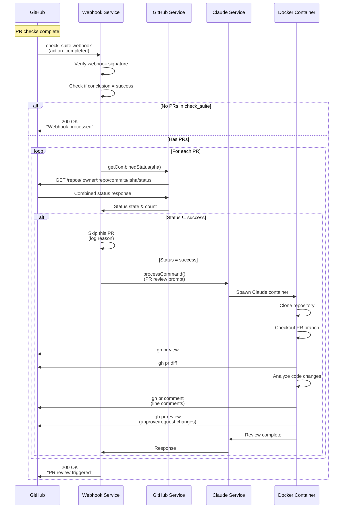
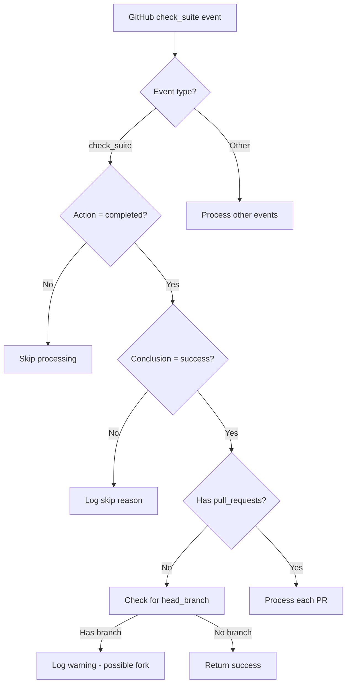
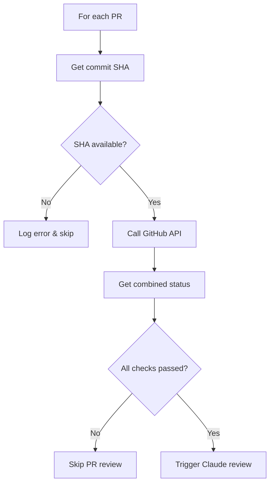
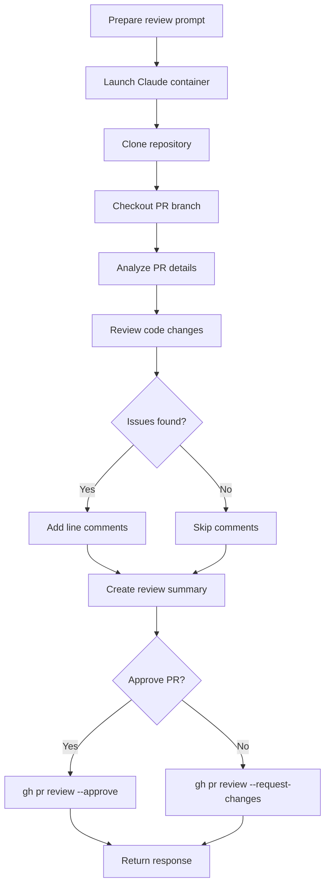
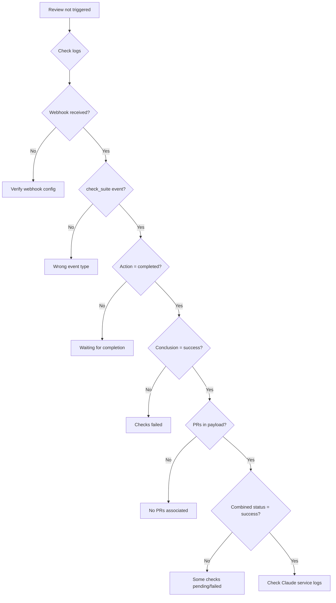

# Automated PR Review Workflow

This document describes the automated pull request review workflow that triggers when all CI checks pass on a PR.

## Overview

The Claude GitHub webhook service automatically reviews pull requests when all status checks complete successfully. This helps maintain code quality by providing consistent, thorough reviews without manual intervention.

## Workflow Sequence



## Detailed Flow

### 1. Webhook Receipt



### 2. PR Status Verification



### 3. Claude Review Process



## Key Components

### GitHub Controller (`githubController.js`)

Handles incoming webhooks and orchestrates the review process:

```javascript
// Webhook handler for check_suite events
if (event === 'check_suite' && payload.action === 'completed') {
  const checkSuite = payload.check_suite;
  
  // Only process successful check suites with PRs
  if (checkSuite.conclusion === 'success' && 
      checkSuite.pull_requests?.length > 0) {
    
    for (const pr of checkSuite.pull_requests) {
      // Verify all status checks passed
      const combinedStatus = await githubService.getCombinedStatus({
        repoOwner: repo.owner.login,
        repoName: repo.name,
        ref: pr.head?.sha || checkSuite.head_sha
      });
      
      if (combinedStatus.state === 'success') {
        // Trigger Claude review
        await claudeService.processCommand({
          repoFullName: repo.full_name,
          issueNumber: pr.number,
          command: prReviewPrompt,
          isPullRequest: true,
          branchName: pr.head.ref
        });
      }
    }
  }
}
```

### GitHub Service (`githubService.js`)

Interfaces with GitHub API to check PR status:

```javascript
async function getCombinedStatus({ repoOwner, repoName, ref }) {
  const url = `https://api.github.com/repos/${repoOwner}/${repoName}/commits/${ref}/status`;
  
  const response = await axios.get(url, {
    headers: {
      Authorization: `token ${githubToken}`,
      Accept: 'application/vnd.github.v3+json'
    }
  });
  
  return {
    state: response.data.state, // success, pending, failure
    total_count: response.data.total_count,
    statuses: response.data.statuses
  };
}
```

### Claude Service (`claudeService.js`)

Manages Claude container execution:

```javascript
async function processCommand({ repoFullName, issueNumber, command, isPullRequest, branchName }) {
  // Spawn privileged container with Claude
  const container = await docker.run('claudecode', {
    env: {
      REPO_FULL_NAME: repoFullName,
      ISSUE_NUMBER: issueNumber,
      IS_PULL_REQUEST: isPullRequest,
      BRANCH_NAME: branchName
    },
    privileged: true,
    capabilities: ['NET_ADMIN', 'NET_RAW', 'SYS_ADMIN']
  });
  
  // Execute review command
  const result = await container.exec(['claude', 'review', '--pr', issueNumber]);
  return result;
}
```

## Configuration

### Required Environment Variables

- `GITHUB_TOKEN`: GitHub personal access token with repo and workflow permissions
- `GITHUB_WEBHOOK_SECRET`: Secret for validating webhook payloads
- `BOT_USERNAME`: GitHub username that triggers reviews (e.g., `@ClaudeBot`)
- `ANTHROPIC_API_KEY`: API key for Claude access

### GitHub Webhook Configuration

1. Go to repository Settings → Webhooks
2. Add webhook with URL: `https://your-domain/api/webhooks/github`
3. Content type: `application/json`
4. Secret: Use the value from `GITHUB_WEBHOOK_SECRET`
5. Events to trigger:
   - Check suites
   - Pull requests (optional, for manual triggers)
   - Issue comments (for manual triggers via mentions)

## Review Process Details

### What Claude Reviews

1. **Security vulnerabilities**
   - SQL injection risks
   - XSS vulnerabilities
   - Authentication/authorization issues
   - Sensitive data exposure

2. **Code quality**
   - Logic errors and edge cases
   - Performance issues
   - Code organization and readability
   - Error handling completeness

3. **Best practices**
   - Design patterns usage
   - Testing coverage
   - Documentation quality
   - Dependency management

### Review Output

Claude provides feedback through:

1. **Line comments**: Specific issues on exact code lines
2. **General comments**: Overall observations and suggestions
3. **Review decision**: 
   - ✅ Approve: Code meets quality standards
   - 🔄 Request changes: Issues need addressing
   - 💬 Comment: Observations without blocking

## Troubleshooting

### PR Review Not Triggering



### Common Issues

1. **Missing pull_requests in webhook payload**
   - Usually occurs with PRs from forks
   - GitHub may not include PR data in check_suite events for security

2. **Combined status shows pending**
   - Some required checks haven't completed
   - Check GitHub PR page for status details

3. **Authentication errors**
   - Verify GITHUB_TOKEN has correct permissions
   - Ensure token hasn't expired

4. **Container execution failures**
   - Check Docker daemon is running
   - Verify Claude container image exists
   - Ensure sufficient permissions for privileged containers

## Testing

### Manual Testing

1. Create a test PR with passing checks
2. Monitor webhook logs: `docker compose logs -f webhook`
3. Verify review appears on PR

### Automated Testing

```bash
# Run unit tests
npm run test:unit

# Run integration tests
npm run test:integration

# Test specific webhook handling
npm test -- --testPathPattern=githubController-check-suite
```

## Performance Considerations

- Each PR review spawns a new container (isolation)
- Reviews run sequentially within a check_suite
- Typical review time: 30-60 seconds per PR
- Container cleanup happens automatically

## Security Notes

1. **Webhook validation**: All webhooks are verified using HMAC-SHA256
2. **Token storage**: Use secure credential management (not env vars in production)
3. **Container isolation**: Each review runs in an isolated container
4. **Network policies**: Containers have restricted network access
5. **Code execution**: Claude only analyzes, doesn't execute PR code

## Future Enhancements

- [ ] Parallel PR reviews for multiple PRs
- [ ] Caching for faster repository cloning
- [ ] Custom review rules per repository
- [ ] Review quality metrics and analytics
- [ ] Integration with other CI/CD tools