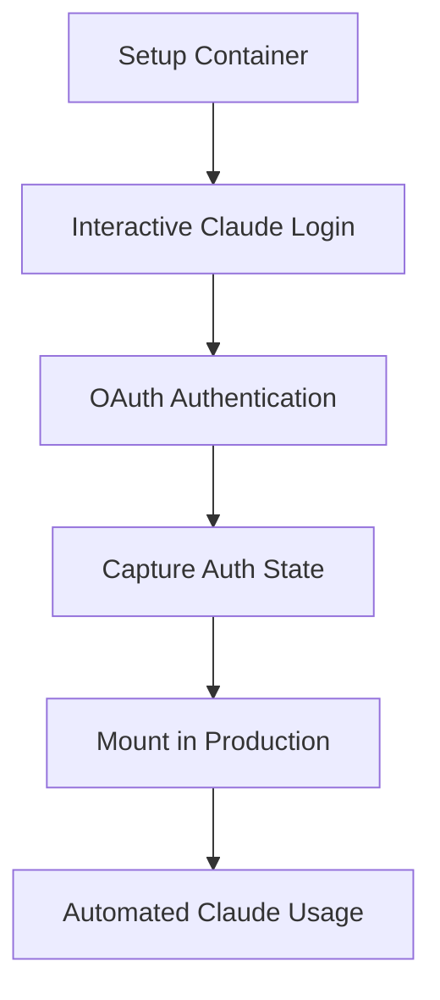

# Setup Container Deep Dive

The setup container method allows Claude Max subscribers to use their existing subscriptions for automation and webhook integrations by capturing and reusing authentication state.

## The Approach

Traditional Claude CLI usage requires interactive sessions. This setup container captures the complete authentication state, including OAuth tokens and session data, making it portable to non-interactive environments.

## How It Works



### 1. Interactive Authentication
- Clean container environment with Claude CLI
- User runs `claude login` and completes browser flow
- OAuth tokens are stored locally

### 2. State Capture
- Complete `~/.claude` directory is copied on container exit
- Includes credentials, settings, project data, session info
- Preserves all authentication context

### 3. Production Mount
- Captured authentication mounted read-only
- Working copy created for each execution
- OAuth tokens used automatically by Claude CLI

## Architecture Benefits

### For Claude Max/20x Subscribers
- **Massive Cost Savings**: Use subscription instead of pay-per-token
- **Full Feature Access**: All subscription benefits (speed, priority)
- **No Usage Anxiety**: Use existing subscription limits

### Technical Advantages
- **OAuth Security**: No API keys in environment variables
- **Session Persistence**: Maintains Claude CLI session state
- **Portable**: Works across different container environments
- **Reusable**: One setup, multiple deployments

## Files Captured

The setup container captures all essential Claude authentication files:

```bash
~/.claude/
├── .credentials.json          # OAuth tokens (primary auth)
├── settings.local.json        # User preferences
├── projects/                  # Project history
├── todos/                     # Task management data
├── statsig/                   # Analytics and feature flags
└── package.json              # CLI dependencies
```

### Critical File: .credentials.json
```json
{
  "claudeAiOauth": {
    "accessToken": "sk-ant-oat01-...",
    "refreshToken": "sk-ant-ort01-...",
    "expiresAt": 1748658860401,
    "scopes": ["user:inference", "user:profile"]
  }
}
```

## Container Implementation

### Setup Container (`Dockerfile.claude-setup`)
- Node.js environment with Claude CLI
- Interactive shell for authentication
- Signal handling for clean state capture
- Automatic file copying on exit

### Entrypoint Scripts
- **Authentication copying**: Comprehensive file transfer
- **Permission handling**: Correct ownership for container user
- **Debug output**: Detailed logging for troubleshooting

## Token Lifecycle and Management

### Token Expiration Timeline
Based on testing, Claude OAuth tokens typically expire within **8-12 hours**:
- **Access tokens**: Short-lived (8-12 hours)
- **Refresh tokens**: Longer-lived but also expire
- **Automatic refresh**: Claude CLI attempts to refresh when needed

### Refresh Token Behavior
```json
{
  "claudeAiOauth": {
    "accessToken": "sk-ant-oat01-...",     // Short-lived
    "refreshToken": "sk-ant-ort01-...",   // Used to get new access tokens
    "expiresAt": 1748658860401,           // Timestamp when access token expires
    "scopes": ["user:inference", "user:profile"]
  }
}
```

### Automatic Refresh Strategy
The Claude CLI automatically attempts to refresh tokens when:
- Access token is expired or near expiration
- API calls return authentication errors
- Session state indicates refresh is needed

However, refresh tokens themselves eventually expire, requiring **full re-authentication**.

### Expected Maintenance Schedule
For production usage with setup containers:

**Daily Operations** (Recommended)
- Monitor authentication health
- Check for expired tokens in logs

**Weekly Maintenance** (Conservative)
- Re-run authentication setup
- Update captured authentication state
- Test authentication validity

**As-Needed Basis** (Minimum)
- Re-authenticate when tokens expire
- Typically required every few days to weeks

### Automated Refresh Implementation
Currently, token refresh requires manual intervention. Future enhancements could include:

```bash
# Planned: Automated refresh script
./scripts/setup/refresh-claude-auth.sh

# Planned: Health check with auto-refresh
./scripts/setup/check-and-refresh-auth.sh
```

## Advanced Usage

### Multiple Environments
```bash
# Development
./${CLAUDE_HUB_DIR:-~/.claude-hub} → ~/.claude/

# Staging
./claude-auth-staging → staging container

# Testing
./claude-auth-test → test container
```

### Team Sharing
```bash
# Capture authentication
./scripts/setup/setup-claude-interactive.sh

# Share auth directory (be cautious with tokens)
tar -czf claude-auth.tar.gz ${CLAUDE_HUB_DIR:-~/.claude-hub}/

# Deploy to team environments
```

## Security Considerations

### Token Protection
- OAuth tokens are sensitive credentials
- Store in secure, encrypted storage
- Rotate regularly by re-authenticating

### Container Security
- Mount authentication read-only
- Use minimal container privileges
- Avoid logging sensitive data

### Network Security
- HTTPS for all Claude API communication
- Secure token transmission
- Monitor for token abuse

## Monitoring and Maintenance

### Health Checks
```bash
# Test authentication status
./scripts/setup/test-claude-auth.sh

# Verify token validity
docker run --rm -v "./${CLAUDE_HUB_DIR:-~/.claude-hub}:/home/node/.claude:ro" \
  claude-setup:latest claude status
```

### Refresh Workflow
```bash
# When authentication expires
./scripts/setup/setup-claude-interactive.sh

# Update production environment
cp -r ${CLAUDE_HUB_DIR:-~/.claude-hub}/* ~/.claude/
docker compose restart webhook
```

## Troubleshooting

### Common Issues

#### 1. Empty .credentials.json
**Symptom**: Authentication fails, file exists but is 0 bytes
**Cause**: Interactive authentication wasn't completed
**Solution**: Re-run setup container and complete browser flow

#### 2. Permission Errors
**Symptom**: "Permission denied" accessing .credentials.json
**Cause**: File ownership mismatch in container
**Solution**: Entrypoint scripts handle this automatically

#### 3. OAuth Token Expired
**Symptom**: "Invalid API key" or authentication errors
**Cause**: Tokens expired (natural expiration)
**Solution**: Re-authenticate using setup container

#### 4. Mount Path Issues
**Symptom**: Authentication files not found in container
**Cause**: Incorrect volume mount in docker-compose
**Solution**: Verify mount path matches captured auth directory

### Debug Commands

```bash
# Check captured files
ls -la ${CLAUDE_HUB_DIR:-~/.claude-hub}/

# Test authentication directly
docker run --rm -v "$(pwd)/${CLAUDE_HUB_DIR:-~/.claude-hub}:/tmp/auth:ro" \
  --entrypoint="" claude-setup:latest \
  bash -c "cp -r /tmp/auth /home/node/.claude && 
           sudo -u node env HOME=/home/node \
           /usr/local/share/npm-global/bin/claude --print 'test'"

# Verify OAuth tokens
cat ${CLAUDE_HUB_DIR:-~/.claude-hub}/.credentials.json | jq '.claudeAiOauth'
```

## Future Enhancements

### Planned Improvements
- **Automatic token refresh**: Monitor and refresh expired tokens
- **Multi-user support**: Separate auth for different users
- **Token rotation**: Automated re-authentication workflow
- **Health monitoring**: Proactive auth status checking

### Community Contributions
- **Authentication sharing**: Secure team auth distribution
- **Cloud storage**: Store auth in encrypted cloud storage
- **CI/CD integration**: Automated auth setup in pipelines

## Cost Analysis for $200/month Users

### Traditional API Approach
- **Claude 3.5 Sonnet**: ~$15 per million tokens
- **Heavy usage**: Easily $500+ per month
- **Usage anxiety**: Every request costs money

### Setup Container Approach
- **Fixed cost**: $200/month for Claude 20x
- **Unlimited usage**: Within subscription limits
- **Peace of mind**: No per-request charging

### Break-even Analysis
If you would use more than ~13 million tokens per month, the setup container approach with Claude 20x subscription becomes cost-effective while providing better performance and unlimited usage.

## Real-world Applications

### Development Workflows
- **Code review automation**: PR reviews without API costs
- **Issue auto-tagging**: Unlimited issue processing
- **Documentation generation**: Bulk doc creation
- **Test case generation**: Comprehensive test coverage

### Personal Projects
- **GitHub automation**: Personal repository management
- **Content creation**: Blog posts, documentation
- **Learning projects**: Educational coding assistance
- **Prototyping**: Rapid development iteration

### Small Business
- **Customer support**: Automated responses
- **Content moderation**: Community management
- **Documentation**: Internal knowledge base
- **Training**: Employee onboarding assistance

---

*The setup container approach democratizes Claude automation for subscription users, making enterprise-level AI automation accessible at subscription pricing.*