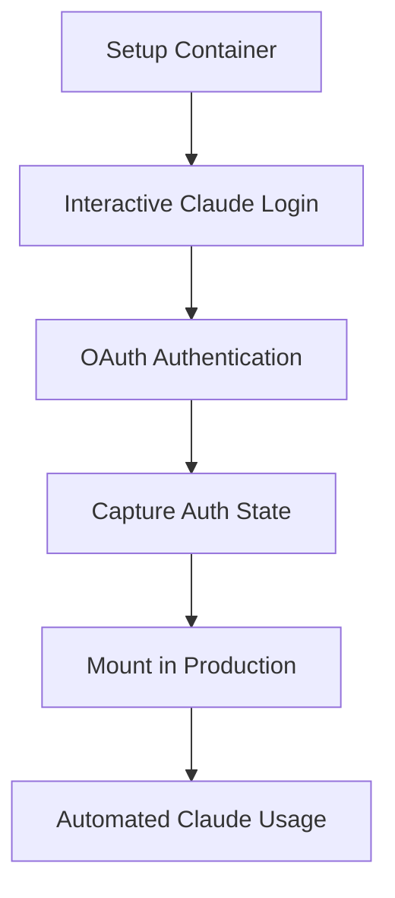

# Setup Container Authentication

The setup container method captures Claude CLI authentication state for use in automated environments by preserving OAuth tokens and session data.

## Overview

Claude CLI requires interactive authentication. This container approach captures the authentication state from an interactive session and makes it available for automated use.

**Prerequisites**: Requires active Claude Code subscription.

## How It Works



### 1. Interactive Authentication
- Clean container environment with Claude CLI installed
- User runs `claude --dangerously-skip-permissions` and completes authentication
- OAuth tokens and session data stored in `~/.claude`

### 2. State Capture
- Complete `~/.claude` directory copied to persistent storage on container exit
- Includes credentials, settings, project data, and session info
- Preserves all authentication context

### 3. Production Mount
- Captured authentication mounted in production containers
- Working copy created for each execution to avoid state conflicts
- OAuth tokens used automatically by Claude CLI

## Technical Benefits

- **OAuth Security**: Uses OAuth tokens instead of API keys in environment variables
- **Session Persistence**: Maintains Claude CLI session state across executions
- **Portable**: Authentication state works across different container environments
- **Reusable**: One-time setup supports multiple deployments

## Files Captured

The setup container captures all essential Claude authentication files:

```bash
~/.claude/
├── .credentials.json          # OAuth tokens (primary auth)
├── settings.local.json        # User preferences
├── projects/                  # Project history
├── todos/                     # Task management data
├── statsig/                   # Analytics and feature flags
└── package.json              # CLI dependencies
```

### Critical File: .credentials.json
```json
{
  "claudeAiOauth": {
    "accessToken": "sk-ant-oat01-...",
    "refreshToken": "sk-ant-ort01-...",
    "expiresAt": 1748658860401,
    "scopes": ["user:inference", "user:profile"]
  }
}
```

## Container Implementation

### Setup Container (`Dockerfile.claude-setup`)
- Node.js environment with Claude CLI
- Interactive shell for authentication
- Signal handling for clean state capture
- Automatic file copying on exit

### Entrypoint Scripts
- **Authentication copying**: Comprehensive file transfer
- **Permission handling**: Correct ownership for container user
- **Debug output**: Detailed logging for troubleshooting

## Token Lifecycle and Management

### Token Expiration Timeline
Claude OAuth tokens typically expire within **8-12 hours**:
- **Access tokens**: Short-lived (8-12 hours)
- **Refresh tokens**: Longer-lived but also expire
- **Automatic refresh**: Claude CLI attempts to refresh when needed

### Refresh Token Behavior
```json
{
  "claudeAiOauth": {
    "accessToken": "sk-ant-oat01-...",     // Short-lived
    "refreshToken": "sk-ant-ort01-...",   // Used to get new access tokens
    "expiresAt": 1748658860401,           // Timestamp when access token expires
    "scopes": ["user:inference", "user:profile"]
  }
}
```

### Automatic Refresh Strategy
The Claude CLI automatically attempts to refresh tokens when:
- Access token is expired or near expiration
- API calls return authentication errors
- Session state indicates refresh is needed

However, refresh tokens themselves eventually expire, requiring **full re-authentication**.

### Maintenance Requirements

**Monitoring**
- Check authentication health regularly
- Monitor for expired token errors in logs

**Re-authentication**
- Required when OAuth tokens expire
- Test authentication validity after updates

### Current Limitations

- Token refresh requires manual intervention
- No automated re-authentication when tokens expire
- Manual monitoring required for authentication health

## Advanced Usage

### Multiple Environments
```bash
# Development
./${CLAUDE_HUB_DIR:-~/.claude-hub} → ~/.claude/

# Staging
./claude-auth-staging → staging container

# Testing
./claude-auth-test → test container
```

## Security Considerations

### Token Protection
- OAuth tokens are sensitive credentials
- Store in secure, encrypted storage
- Rotate regularly by re-authenticating

### Container Security
- Mount authentication with appropriate permissions
- Use minimal container privileges
- Avoid logging sensitive data

### Network Security
- HTTPS for all Claude API communication
- Secure token transmission
- Monitor for token abuse

## Monitoring and Maintenance

### Health Checks
```bash
# Test authentication status
./scripts/setup/test-claude-auth.sh

# Verify token validity
docker run --rm -v "./${CLAUDE_HUB_DIR:-~/.claude-hub}:/home/node/.claude:ro" \
  claude-setup:latest claude --dangerously-skip-permissions
```

### Refresh Workflow
```bash
# When authentication expires
./scripts/setup/setup-claude-interactive.sh

# Update production environment
cp -r ${CLAUDE_HUB_DIR:-~/.claude-hub}/* ~/.claude/
docker compose restart webhook
```

## Troubleshooting

### Common Issues

#### 1. Empty .credentials.json
**Symptom**: Authentication fails, file exists but is 0 bytes
**Cause**: Interactive authentication wasn't completed
**Solution**: Re-run setup container and complete authentication flow

#### 2. Permission Errors
**Symptom**: "Permission denied" accessing .credentials.json
**Cause**: File ownership mismatch in container
**Solution**: Entrypoint scripts handle this automatically

#### 3. OAuth Token Expired
**Symptom**: "Invalid API key" or authentication errors
**Cause**: Tokens expired (natural expiration)
**Solution**: Re-authenticate using setup container

#### 4. Mount Path Issues
**Symptom**: Authentication files not found in container
**Cause**: Incorrect volume mount in docker-compose
**Solution**: Verify mount path matches captured auth directory

### Debug Commands

```bash
# Check captured files
ls -la ${CLAUDE_HUB_DIR:-~/.claude-hub}/

# Test authentication directly
docker run --rm -v "$(pwd)/${CLAUDE_HUB_DIR:-~/.claude-hub}:/tmp/auth:ro" \
  --entrypoint="" claude-setup:latest \
  bash -c "cp -r /tmp/auth /home/node/.claude && 
           sudo -u node env HOME=/home/node \
           /usr/local/share/npm-global/bin/claude --dangerously-skip-permissions --print 'test'"

# Verify OAuth tokens
cat ${CLAUDE_HUB_DIR:-~/.claude-hub}/.credentials.json | jq '.claudeAiOauth'
```

---

*The setup container approach provides a technical solution for capturing and reusing Claude CLI authentication in automated environments.*