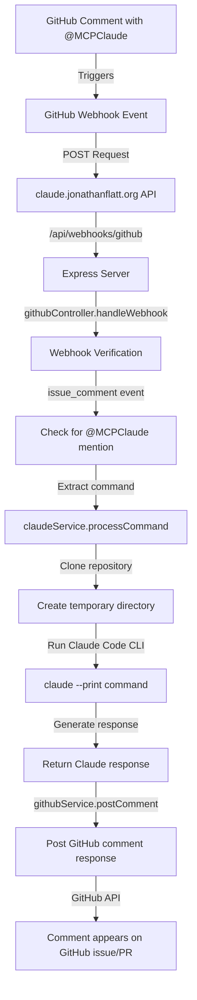

# Claude GitHub Integration Workflow

This document describes the workflow for how GitHub comments trigger Claude responses through our integration.

## Workflow Diagram

## Detailed Flow

1. **GitHub Comment Trigger**
   - User creates a GitHub comment mentioning "@MCPClaude" with a command
   - GitHub detects the comment creation event

2. **Webhook Delivery**
   - GitHub sends a webhook event to `claude.jonathanflatt.org`
   - The payload contains the comment content, issue/PR information, and repository details

3. **API Endpoint Processing**
   - Express server receives the webhook at `/api/webhooks/github`
   - `githubController.handleWebhook` processes the incoming request

4. **Webhook Verification**
   - The controller verifies the webhook signature to ensure it came from GitHub
   - Validates the event type is `issue_comment` and action is `created`

5. **Command Extraction**
   - For issue comments, the code checks for "@MCPClaude" mentions
   - If found, it extracts the command text that follows the mention

6. **Claude Service Processing**
   - `claudeService.processCommand` clones the repository to a temporary directory
   - Prepares the environment for Claude Code execution

7. **Claude Code CLI Execution**
   - Claude Code CLI is executed with the command in the repository context
   - Uses AWS Bedrock credentials for Claude API access if configured

8. **Response Generation**
   - Claude processes the command and generates a detailed response
   - The response is captured from the CLI output

9. **GitHub Response Posting**
   - `githubService.postComment` posts the response as a comment
   - Uses GitHub API to add the comment to the original issue/PR

10. **Workflow Completion**
    - The response appears on GitHub, visible to all repository users
    - The temporary repository clone is deleted

## System Components

- **Express Server**: Handles incoming webhook requests
- **GitHub Controller**: Processes GitHub events and orchestrates the workflow
- **Claude Service**: Interfaces with Claude Code CLI
- **GitHub Service**: Manages GitHub API interactions

## Environment Requirements

- GitHub token with repository access
- Claude Code CLI installed
- AWS credentials (if using Bedrock configuration)
- Webhook endpoints properly configured